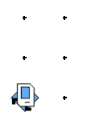
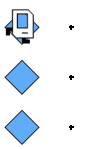
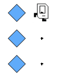
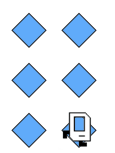

# Karel's Hospital Problem guides (after section)

Hi everyone! After we have done writing code together, here are the code that we ends with 

```Python 
from karel.stanfordkarel import *

# Here is a place to program your Section problem

def main():
    """
    You should write your code to make Karel do its task in
    this function. Make sure to delete the 'pass' line before
    starting to write your own code. You should also delete this
    comment and replace it with a better, more descriptive one.
    """
    move_to_beeper()
    # build hospital 
    build_hospital()
    move()
    move()
    move()
    move()
    move()
    build_hospital()
    move()

def build_hospital():
    turn_left()
    move()
    put_beeper()
    move()
    put_beeper()
    turn_right()
    move()
    put_beeper()
    turn_right()
    move()
    put_beeper()
    move()
    put_beeper()
    turn_left()

def turn_right():
    turn_left()
    turn_left()
    turn_left()

        
def move_to_beeper():
    # Move until Karel finds a beeper
    move()
    move()

if __name__ == '__main__':
    main()
```

Which is a good start, but how do we start from this ? Since we already have a separate function, we could start from checking the correctness of each function. 

**So if you would like to start from here:**
We have done a good job writing code so far, but one thing I forgot to mention during the class is that we should generalize the method, but not to make them work on specific configuration. 

1. `move_to_beeper()`

First hint : 
Here are the available function for you :  front_is_clear(), no_beepers_present()

Second hint : 
You can use while loop , and if condition. Take a look at the section slide on how we use while loop and if condition.

2. `build_hospital()`

First Hint : How can we make the code shorter ? Can we rewrite them to the sequence of functions? Like when you trying to tell someone to build a hospital for you, without telling the detailed step, and start from there.

3. `main()`

First hint : Try to utilize `move_to_beeper()` and  `build_hospital()` in the `main()`.


**Bonus**: In `turn_right()` function, instead of writing `turn_left()` 3 times, what can we do instead? 


# Solution 

1. `move_to_beeper()`

Since we won't be able to know when the karel will arrive at the beeper, so we will use while loop to walk until the karel found the beeper. 

```Python
def move_to_beeper():
    while no_beepers_present():
        move()
```
I would recommend you to try this function and see if there is any problem with it. What do the Karel do when it encounter the wall? Does it stop? (Feel free to stop here, and try to fix it yourself first, then you can look at the solution below.)

As we have tried, it wouldn't work, as it does not check if it's safe to move. So we add an additional check before we move. 

```Python
def move_to_beeper():
    while no_beepers_present():
        if front_is_clear():
            move()
```


2. `build_hospital()`

While the code above is correct, and can run perfectly fine. We can simplify them a little bit more, by trying to look at the higher level concept. 

based on the code above, we can break down the code above into three things.

1. build one column upward 
2. move from the top of column to the right side. 
3. build one column downward 

For each of them, we will define step 1 and 3 as `build_upward()`, `build_downward()` respectively. However, when we create any function, we should think of what would be the pre-condition and post-condition of running those function. For example,


||Pre-condition|Post-condition|
|------|--------|-----------|
|`build_upward()`| | |
|`build_downward()`|| |

Therefore, the code for each part would be 

```Python
def build_upward():
    turn_left()
    for i in range(2):
        move()
        put_beeper()
    turn_right()
```
and 
```Python
def build_downward():
    put_beeper()
    turn_right()
    for i in range(2):
        move()
        put_beeper()
    turn_left()
```
and now, to build a hospital, we have : 
```Python
def build_hospital():
    build_upward() 
    move()
    build_downward()
```


3. `main()`

Since we already made sure that `build_hospital()` and `move_to_beeper()` were correct. We can combine these function as the following : 

```Python
def main():
    while front_is_clear():
        move_to_beeper()
        build_hospital()
        if front_is_clear():
            move()
```

Now, here is the solution from the version we build during the section meeting : 

```Python
from karel.stanfordkarel import *

def main():
    while front_is_clear():
        move_to_beeper()
        build_hospital()
        if front_is_clear():
            move()

def move_to_beeper():
    while no_beepers_present():
        if front_is_clear():
            move()

def build_upward():
    turn_left()
    for i in range(2):
        move()
        put_beeper()
    turn_right()

def build_downward():
    put_beeper()
    turn_right()
    for i in range(2):
        move()
        put_beeper()
    turn_left()

def build_hospital():
    build_upward() 
    move()
    build_downward()

def turn_right():
    for i in range(3):
        turn_left()

if __name__ == "__main__":
    main()
```

**Bonus :** 
To simplify further, we can see that we write this part in both `main()` and `move_to_beeper()`
```Python
if front_is_clear():
    move()
```
We can separated them into a function like the official solution, which is called `safe_move()` as we check for the wall before we move. So here is the modified solution after adding `safe_move()` function.

```Python
from karel.stanfordkarel import *

def main():
    while front_is_clear():
        move_to_beeper()
        build_hospital()
        safe_move()

def safe_move():
    if front_is_clear():
        move()

def move_to_beeper():
    while no_beepers_present():
        safe_move()

def build_upward():
    turn_left()
    for i in range(2):
        move()
        put_beeper()
    turn_right()

def build_downward():
    put_beeper()
    turn_right()
    for i in range(2):
        move()
        put_beeper()
    turn_left()

def build_hospital():
    build_upward() 
    move()
    build_downward()

def turn_right():
    for i in range(3):
        turn_left()

if __name__ == "__main__":
    main()
```